XPrivacy
========

The ultimate, yet easy to use, privacy manager for Android


([publication](http://www.blackducksoftware.com/news/releases/black-duck-announces-open-source-rookies-year-winners))

Index
-----

* [Description](https://github.com/M66B/XPrivacy#description)
* [Features](https://github.com/M66B/XPrivacy#features)
* [Restrictions](https://github.com/M66B/XPrivacy#restrictions)
* [Limitations](https://github.com/M66B/XPrivacy#limitations)
* [Compatibility](https://github.com/M66B/XPrivacy#compatibility)
* [Installation](https://github.com/M66B/XPrivacy#installation)
* [Upgrading](https://github.com/M66B/XPrivacy#upgrading)
* [Usage](https://github.com/M66B/XPrivacy#usage)
* [Permissions](https://github.com/M66B/XPrivacy#permissions)
* [Frequently asked questions](https://github.com/M66B/XPrivacy#frequently-asked-questions)
* [Support](https://github.com/M66B/XPrivacy#support)
* [Changelog](https://github.com/M66B/XPrivacy/blob/master/CHANGELOG.md)
* [Similar solutions](https://github.com/M66B/XPrivacy#similar-solutions)
* [News](https://github.com/M66B/XPrivacy#news)
* [Contributing](https://github.com/M66B/XPrivacy#contributing)
* [License](https://github.com/M66B/XPrivacy#license)

Description
-----------

XPrivacy can prevent applications from leaking privacy-sensitive data
by restricting the categories of data an application can access.
XPrivacy feeds applications fake data or no data at all.
It can restrict several data categories, such as *contacts* or *location*.
For example, if you restrict an application's access to contacts,
that application will receive an empty contacts list.
Similarly, restricting an application's access to your location will send a fake location to that application.

XPrivacy doesn't revoke or block permissions from an application,
so most applications will continue to work as before and won't force close (crash).
There are two exceptions: access to the internet and to external storage (typically an SD card)
are restricted by denying access (revoking permissions).
There is no other way to restrict such access
because Android delegates handling these permissions to the underlying Linux network/file system.
XPrivacy can fake an offline (internet) and unmounted (storage) state,
but some applications still try to access the internet and storage,
potentially resulting in crashes or error messages.
If restricting a category of data for an application causes functional limitations,
XPrivacy can once again allow access to the data category to solve the issue.
There is a convenient on/off switch for all restrictions for each application.

By default, all newly installed applications cannot access any data category,
which prevents a new application from leaking sensitive data right after installing it.
Shortly after installing a new application,
XPrivacy will ask which data categories you want the new application to have access to.
XPrivacy comes with an application browser
that allows you to quickly enable or disable applications' access to any data category.
You can edit all of an application's data categories.

To help you identify potential data leaks,
XPrivacy monitors all applications' attempts to access sensitive data.
XPrivacy displays an orange warning triangle icon when an application has attempted to access data.
If an application has requested Android permissions to access data, XPrivacy displays a green key icon.
XPrivacy also displays an internet icon if an application has internet access,
which clarifies that the application poses a risk of sharing data with an external server.

XPrivacy is built using the [Xposed framework](http://forum.xda-developers.com/showthread.php?t=1574401),
which it uses to tap into a vast number of carefully selected Android functions.
Depending on the function, XPrivacy skips execution of the original function
(for example when an application tries to set a proximity alert)
or alters the result of the original function (for example to return an empty message list).

XPrivacy has been tested with Android version 4.0.3 - 4.4.3 (ICS, JellyBean, KitKat),
and is reported to work with most Android variants, including stock ROMs.
Root access is needed to install the Xposed framework.


**XPrivacy was a lot of work, so please support this project**

Donate a few dollars for the [pro version](http://www.xprivacy.eu/)

OR

buy [the pro enabler](https://play.google.com/store/apps/details?id=biz.bokhorst.xprivacy.pro) from Google Play Store

OR

[](http://flattr.com/thing/1491130/ "The ultimate, yet easy to use, privacy manager")


**Using XPrivacy is entirely at your own risk**

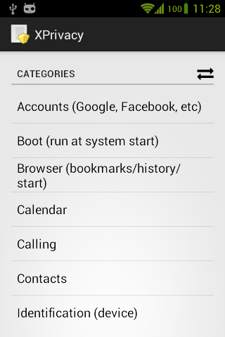
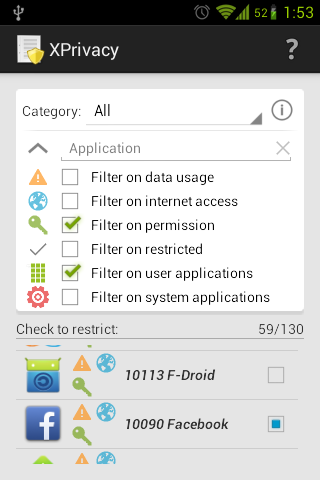
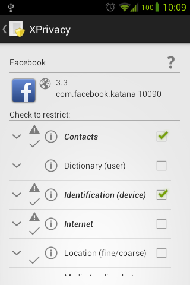

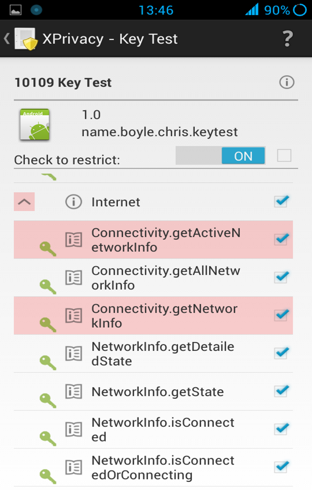
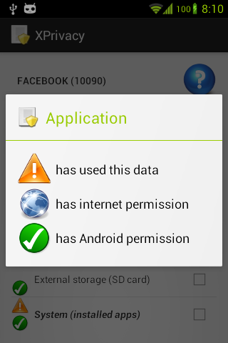
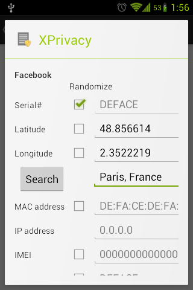
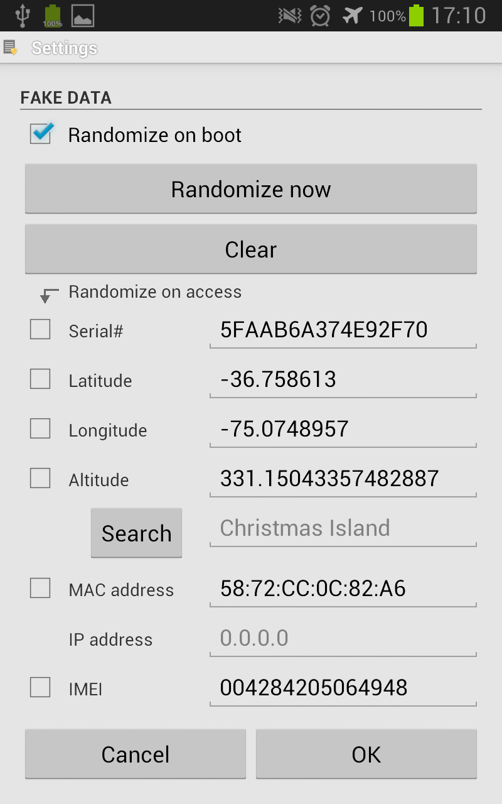
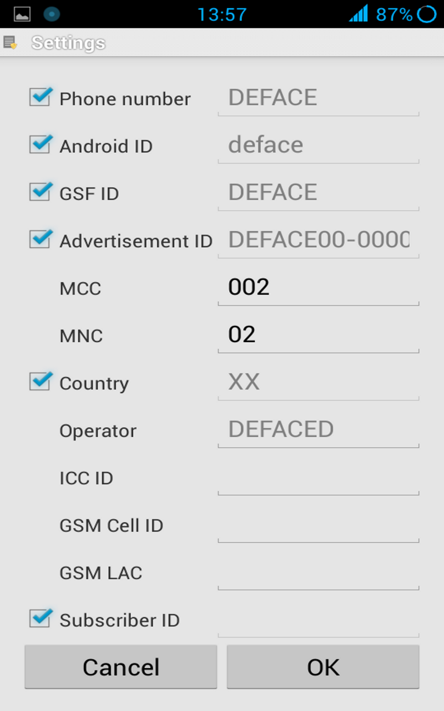
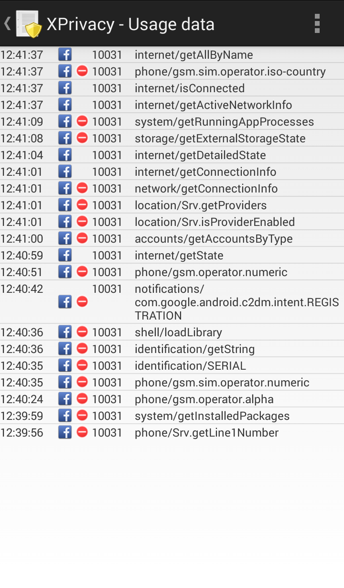
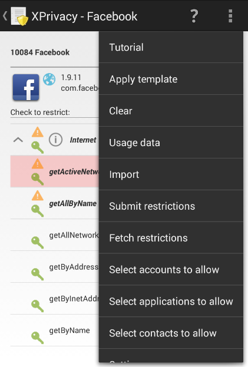
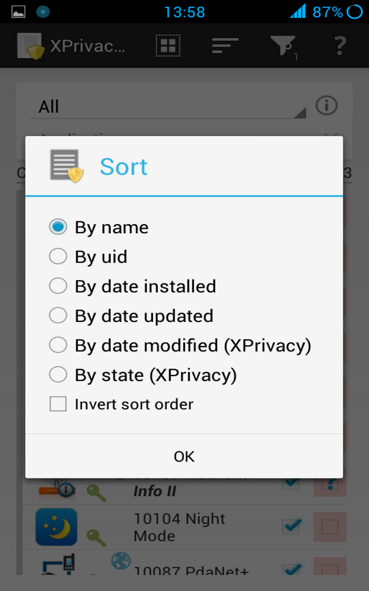
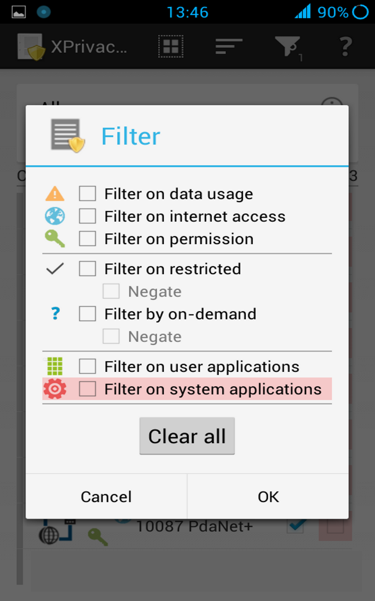
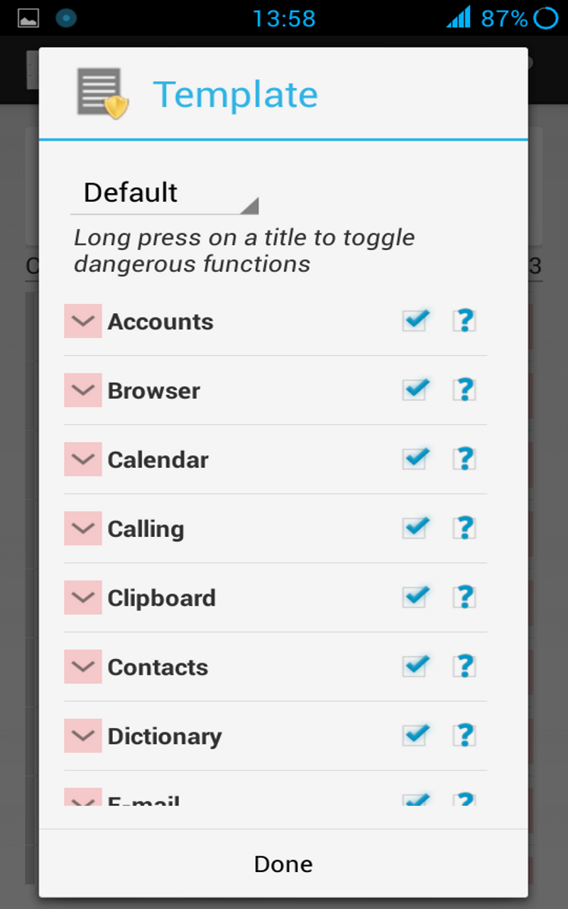
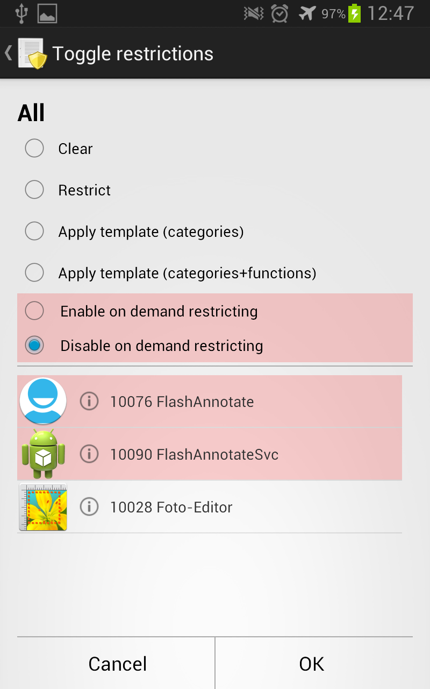
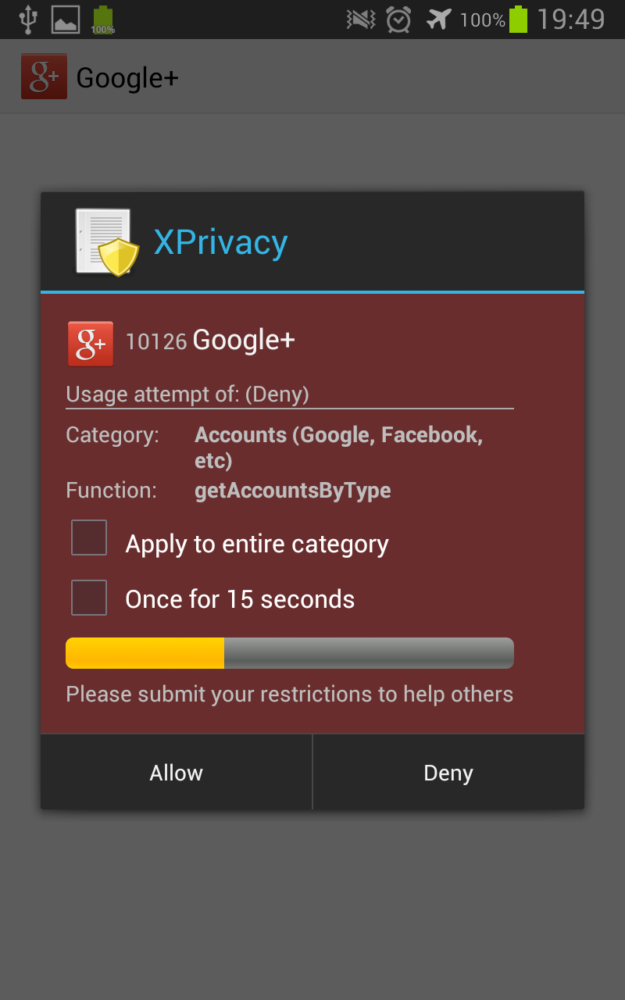
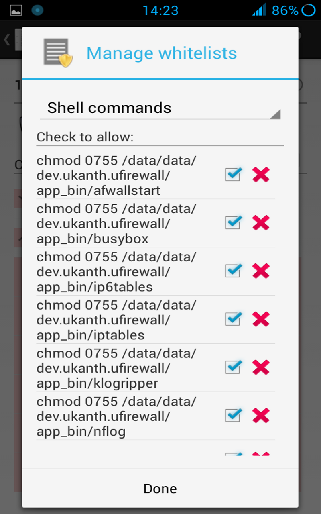
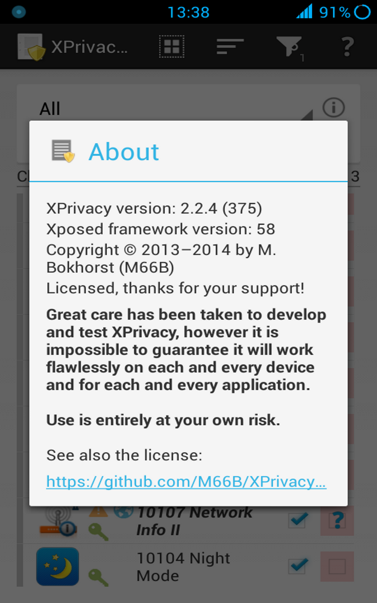

Features
--------

* Simple to use
* No need to patch anything (no source, no [smali](https://code.google.com/p/smali/) or anything else)
* For any (stock) variant of Android version 4.0.3 - 4.4.3 (ICS, JellyBean, KitKat)
* Newly installed applications are restricted by default
* Displays data actually used by an application
* Option to restrict on demand
* Free and open source
* Free from advertisements

Restrictions
------------

For easy usage, data is restricted by category:

<a name="accounts"></a>
* Accounts
	* return an empty account list
	* return an empty account type list
	* return fake account info
	* return empty authorization tokens
	* return an empty list of synchronizations
<a name="browser"></a>
* Browser
	* return an empty bookmark list
	* return an empty download list
	* return empty search history
<a name="calendar"></a>
* Calendar
	* return an empty calendar
<a name="calling"></a>
* Calling
	* prevent calls from being placed
	* prevent SMS messages from being sent
	* prevent MMS messages from being sent
	* prevent data messages from being sent
<a name="clipboard"></a>
* Clipboard
	* prevent paste from clipboard (both manual and from an application)
<a name="contacts"></a>
* Contacts
	* return an empty contact list
		* content://com.android.contacts
		* content://com.android.contacts/contacts
		* content://com.android.contacts/data
		* content://com.android.contacts/phone_lookup
		* content://com.android.contacts/profile
<a name="dictionary"></a>
* Dictionary
	* return an empty user dictionary
<a name="email"></a>
* E-mail
	* return an empty list of accounts, e-mails, etc (provider)
	* return an empty list of accounts, e-mails, etc (Gmail)
<a name="identification"></a>
* Identification
	* return a fake Android ID
	* return a fake device serial number
	* return a fake host name
	* return a fake Google services framework ID
	* return file not found for folder [/proc](http://linux.die.net/man/5/proc)
	* return a fake Google advertising ID
	* return a fake system property CID (Card Identification Register = SD card serial number)
	* return file not found for /sys/block/.../cid
	* return file not found for /sys/class/.../cid
	* return fake input device descriptor
<a name="internet"></a>
* Internet
	* revoke permission to internet access
	* revoke permission to internet administration
	* revoke permission to internet bandwidth statistics/administration
	* revoke permission to [VPN](http://en.wikipedia.org/wiki/Vpn) services
	* revoke permission to [Mesh networking](http://en.wikipedia.org/wiki/Mesh_networking) services
	* return fake extra info
	* return fake disconnected state
	* return fake supplicant disconnected state
<a name="IPC"></a>
* IPC
	* Direct inter process calls
		* android.accounts.IAccountManager
		* android.app.IActivityManager
		* android.content.IClipboard
		* android.net.IConnectivityManager
		* android.content.IContentService
		* android.location.ILocationManager
		* com.android.internal.telephony.ITelephonyRegistry
		* com.android.internal.telephony.ITelephonyRegistryMSim
		* android.content.pm.IPackageManager
		* com.android.internal.telephony.IPhoneSubInfo
		* com.android.internal.telephony.msim.IPhoneSubInfoMSim
		* android.view.IWindowManager
		* android.net.wifi.IWifiManager
<a name="location"></a>
* Location
	* return a random or set location (also for Google Play services)
	* return empty cell location
	* return an empty list of (neighboring) cell info
	* prevents geofences from being set (also for Google Play services)
	* prevents proximity alerts from being set
	* prevents sending NMEA data to an application
	* prevent phone state from being sent to an application
		* Cell info changed
		* Cell location changed
	* prevent sending extra commands (aGPS data)
	* return an empty list of Wi-Fi scan results
	* prevent [activity recognition](http://developer.android.com/training/location/activity-recognition.html)
<a name="media"></a>
* Media
	* prevent recording audio
	* prevent taking pictures
	* prevent recording video
	* you will be notified if an application tries to perform any of these actions
<a name="messages"></a>
* Messages
	* return an empty SMS/MMS message list
	* return an empty list of SMS messages stored on the SIM (ICC SMS)
	* return an empty list of voicemail messages
<a name="network"></a>
* Network
	* return fake IP's
	* return fake MAC's (network, Wi-Fi, bluetooth)
	* return fake BSSID/SSID
	* return an empty list of Wi-Fi scan results
	* return an empty list of configured Wi-Fi networks
	* return an empty list of bluetooth adapters/devices
<a name="nfc"></a>
* NFC
	* prevent receiving NFC adapter state changes
	* prevent receiving NDEF discovered
	* prevent receiving TAG discovered
	* prevent receiving TECH discovered
<a name="notifications"></a>
* Notifications
	* prevent applications from receiving [statusbar notifications](https://developer.android.com/reference/android/service/notification/NotificationListenerService.html) (Android 4.3+)
	* prevent [C2DM](https://developers.google.com/android/c2dm/) messages
<a name="overlay"></a>
* Overlay
	* prevent draw over / on top
<a name="phone"></a>
* Phone
	* return a fake own/in/outgoing/voicemail number
	* return a fake subscriber ID (IMSI for a GSM phone)
	* return a fake phone device ID (IMEI): 000000000000000
	* return a fake phone type: GSM (matching IMEI)
	* return a fake network type: unknown
	* return an empty ISIM/ISIM domain
	* return an empty IMPI/IMPU
	* return a fake MSISDN
	* return fake mobile network info
		* Country: XX
		* Operator: 00101 (test network)
		* Operator name: fake
	* return fake SIM info
		* Country: XX
		* Operator: 00101
		* Operator name: fake
		* Serial number (ICCID): fake
	* return empty [APN](http://en.wikipedia.org/wiki/Access_Point_Name) list
	* return no currently used APN
	* return an empty call log
	* prevent phone state from being sent to an application
		* Call forwarding indication
		* Call state changed (ringing, off-hook)
		* Mobile data connection state change / being used
		* Message waiting indication
		* Service state changed (service/no service)
		* Signal level changed
	* return an empty group identifier level 1
<a name="sensors"></a>
* Sensors
	* return an empty default sensor
	* return an empty list of sensors
	* restrict indiviual sensors:
		* acceleration
		* gravity
		* humidity
		* light
		* magnetic
		* motion
		* orientation
		* pressure
		* proximity
		* rotation
		* step
		* temperature
<a name="shell"></a>
* Shell
	* return I/O exception for Linux shell
	* return I/O exception for Superuser shell
	* return unsatisfied link error for load/loadLibrary
<a name="storage"></a>
* Storage
	* revoke permission to the [media storage](http://www.doubleencore.com/2014/03/android-external-storage/)
	* revoke permission to the external storage (SD card)
	* revoke permission to [MTP](http://en.wikipedia.org/wiki/Media_Transfer_Protocol)
	* return fake unmounted state
<a name="system"></a>
* System
	* return an empty list of installed applications
	* return an empty list of recent tasks
	* return an empty list of running processes
	* return an empty list of running services
	* return an empty list of running tasks
	* return an empty list of widgets
	* return an empty list of applications (provider)
	* prevent package add, replace, restart and remove notifications
<a name="view"></a>
* View
	* prevent links from opening in the browser
	* return fake browser user agent string
		* *Mozilla/5.0 (Linux; U; Android; en-us) AppleWebKit/999+ (KHTML, like Gecko) Safari/999.9*

Limitations
-----------

* [/proc](http://linux.die.net/man/5/proc), CID and system (build) properties cannot be restricted for Android (serial number, IMEI, MAC address, etc), because restricting these will result in bootloops
* */proc/self/cmdline* will not be restricted by */proc*, because it will result in instability
* The phone number cannot be restricted for the standard phone application
* The browser bookmarks and history cannot be restricted for the browser itself
* Internet and storage can only be restricted for applications, providers, and services started by the Android package manager
* There is no usage data for *inet*, *media* and *sdcard*, since this is technically not possible
* Because it is static, [Build.SERIAL](http://developer.android.com/reference/android/os/Build.html#SERIAL) can only be randomized when an application starts, and there is no usage data
* Due to a bug in Chromium, the user agent cannot be restricted in all cases ([issue](https://github.com/M66B/XPrivacy/issues/825))
* Due to a custom implementation, the clipboard cannot be restricted on some Samsung stock ROMs ([issue](https://github.com/M66B/XPrivacy/issues/857))
* It is not possible to restrict external hardware MAC addresses or the external IP address
* You cannot restrict *Configuration.MCC/MNC* on demand
* Allowing contacts for SIM-contacts isn't supported (who is using these anyway these days?)
* Calendars and contacts cannot be restricted for specific accounts; it is all or nothing; however, it is possible to allow individual contacts with a [pro license](http://www.xprivacy.eu/)
* The on demand restricting dialog does sometimes not respond and is sometimes hidden
	* A known situation is starting an application from a notification for the restrictions *inet*, *sdcard* and *media*
	* Another known situation are some restrictions triggered by hardware buttons, like the volume buttons
	* This cannot be fixed, because the on demand dialog is locking a system process
	* The on demand dialog will timeout after 20 seconds, so this is not a major problem
* You cannot restrict the serial number and the Android ID for XPrivacy, because it is used for submitting restrictions
	* The Android ID is salted with the serial number and MD5 hashed before communicating with the crowd sourced restrictions server
	* This means that the crowd sourced restrictions server never gets the serial number nor the Android ID
* You cannot restrict *IPC* for XPrivacy because it is needed for internal checks
* You cannot restrict *storage* for XPrivacy because it is needed to read the XPrivacy Pro license file
* You cannot restrict *system* for XPrivacy because it is needed to get an application list
* You cannot restrict *view* for XPrivacy because it is needed to open links to the [crowd sourced restrictions](http://crowd.xprivacy.eu/)

You can still restrict the XPrivacy app's access to accounts, contacts, and other things.

Compatibility
-------------

XPrivacy has been tested with Android version 4.0.3 - 4.4.3 (ICS, JellyBean, KitKat)
and is reported to work with most Android variants, including stock ROMs.

**XPrivacy is incompatible with LBE Security Master** ([issue](https://github.com/M66B/XPrivacy/issues/1231))

XPrivacy seems to be incompatible with [OLYMPUS Image Share](https://play.google.com/store/apps/details?id=jp.olympusimaging.oishare)
for unknown reasons ([issue](https://github.com/M66B/XPrivacy/issues/1607)).

XPrivacy seems to cause camera lag on a Samsung Galaxy Note II ([issue](https://github.com/M66B/XPrivacy/issues/715))

Restricting *Internet/connect* and/or *View/loadURL* for the stock browser doesn't prevent loading of pages ([issue](https://github.com/M66B/XPrivacy/issues/1685))

Installation
------------

**Instead of following the steps below, you can use the [XPrivacy Installer](https://play.google.com/store/apps/details?id=biz.bokhorst.xprivacy.installer).**

Installation may seem lengthy, but you can actually do it quickly:

1. Requirements:
	* Android version 4.0.3 - 4.4.3 (ICS, JellyBean, KitKat); check with *System Settings* > *About phone* > *Android version*
	* Read about [compatibility](https://github.com/M66B/XPrivacy#compatibility) before installing
1. **Make a backup**
1. If you haven't already, root your device; the rooting procedure depends on your device's brand and model.
	* You can find a guide [here](http://www.androidcentral.com/root) for most devices
1. Enable *System settings* > *Security* > *Unknown sources*
1. Install the [Xposed framework](http://forum.xda-developers.com/showthread.php?t=1574401)
	* Be sure to install [the latest version](http://dl.xposed.info/latest.apk)
	* The Xposed fix is not needed anymore
1. Download and install XPrivacy from [here](http://repo.xposed.info/module/biz.bokhorst.xprivacy)
	* Alternatively download it from [here](https://github.com/M66B/XPrivacy/releases)
1. Enable XPrivacy from the Xposed installer
1. Start XPrivacy one time
1. Reboot

I do not recommend using XPrivacy in combination with any of the
[similar solutions](https://github.com/M66B/XPrivacy#similar-solutions),
because this could result in conflicts and potential data leaks.

There is an unofficial backported Gingerbread version available [here](http://forum.xda-developers.com/showpost.php?p=44034334).
Please note that only the official version is supported.

If you want to uninstall XPrivacy, you have two options:

1. Disable XPrivacy in the Xposed installer
1. Uninstall the XPrivacy application

Don't forget to reboot.

Upgrading
---------

* **Make a backup**
* **Do not remove the previous version** (or else your settings will get lost)
* Download the new version
* Install the new version over the previous version
* Start the new version once (else Android will not send the boot completed event)
* Reboot your device
* Wait until the XPrivacy update service has been completed (showing 100%)

When following this procedure, your data will not leak because the Xposed part of XPrivacy keeps running.

Usage
-----

*Very short tutorial*

* Don't think too much ;-)
* Find the application(s) to restrict in the main application list
* Tap on the application icon
* Tap the first check box of any category you want to restrict

Use common sense when restricting, don't expect internet access if you restricted the internet category, etc.

Get used to XPrivacy before using more advanced features, like function exceptions.

*Longer explanation*

The application starts in the main view, where a data category can be selected at the top.
By ticking one or more check boxes in the list below, you can restrict the selected data category for the chosen applications.
The default category is *All*, meaning that all data categories will be restricted.

Tapping on an application icon shows the detailed view where you can manage all the data categories for the selected application.
This view will also appear when you tap on the notification that appears after updating or installing an application.
By default, all data categories will be restricted for newly installed applications to prevent leaking privacy-sensitive data.
You can change which data categories will be restricted by changing the *Template* available from the main menu.

Data categories make it easier to manage restrictions.
You can drill down the data categories in the detailed view to reveal individual functions.
If the category is restricted, you can un-restrict individual functions by clearing the function's check box.

To see restriction in action, try restricting the category *Identification* for
[Android Id Info](https://play.google.com/store/apps/details?id=com.bzgames.androidid)
or try restriction the category *Contacts* for the Contacts application.

**Applying some restrictions require restarting applications**

You can turn on and off all restrictions for an application using the on/off switch.

Since version 1.99 you can also restrict on demand.
This means you will be asked to allow or deny a category/function
when the category/function is used by an application.
Restricting on demand is the default for newly installed applications.
You can turn on and off restricting on demand in the application details view
using either the settings or the check box next to the on/off switch.
You can turn on and off restricting on demand for individual categories and functions
using the second column of check boxes.

If an application has requested Android permissions for a data category,
the category will be marked with a green key icon.
If an application has used or tried to use data, the data category will be marked with an orange warning triangle icon.
If an application has internet permissions, a world globe icon will be shown.
These icons are just a guideline because an application can still access some privacy sensitive data without Android permissions,
such as your device's serial number, and because it is not possible to monitor data usage in each and every situation,
such as access to the internet or the external storage.
Be aware that an application can still access the internet through other (sister) applications.

Restricting internet or storage means blocking access to the internet and to external storage (typically the SD card), respectively.
Either of these may result in error messages and even cause applications to force close (crash).

Function restrictions considered dangerous are marked with a reddish background color.
These dangerous functions are more likely to cause applications to crash if you restrict them.

Global settings and application specific settings are accessible from the application list's menu
and from the menu of the application's detailed view. The global settings,
such as randomized or set latitude/longitude, apply to all applications
unless you override them with specific application settings.
But saving an empty set of specific application settings (you can use the clear button)
will erase all application specific settings so that the global settings will again be in force.

The restrictions template (in the main menu) is applied automatically to newly installed applications
and manually via the menu item "Apply template" in the application's detailed view.

**Using XPrivacy is entirely at your own risk**

Permissions
-----------

XPrivacy asks for the following Android permissions:

* Accounts: to be able to restrict applications' access to accounts
* Contacts: to be able to restrict applications' access to contacts
* Boot: to be able to check if XPrivacy is enabled
* Internet: to be able to submit and fetch [crowd sourced restrictions](http://crowd.xprivacy.eu/)
* Storage: to be able to export XPrivacy's settings to the SD card (only [pro version](http://www.xprivacy.eu/))
* Wakelock: to keep the processor running during batch operations

If desired, you can even restrict XPrivacy from accessing any of the above,
but there are some [limitations](https://github.com/M66B/XPrivacy#limitations).

Please note that any Xposed module has basically root permissions and can therefore circumvent any Android permission.

Frequently asked questions
--------------------------

<a name="FAQ1"></a>
**(1) Will XPrivacy make my device slower?**

Maybe a little bit, but you probably won't notice.

But my device is slow with XPrivacy!
It appeared that in some cases this was caused by the TRIM bug.
See [here](http://forum.xda-developers.com/showthread.php?t=2104326) for more information and a solution.

<a name="FAQ2"></a>
**(2) Does XPrivacy use a lot of memory and battery?**

Almost nothing.

<a name="FAQ3"></a>
**(3) Can you help me with rooting my device?**

There are already enough [guides](http://www.androidcentral.com/root) to help you to root your device.
Use your favorite search engine to find one.

<a name="FAQ4"></a>
**(4) How can I reset an application's XPrivacy settings?**

While viewing an application's restrictions, do "Menu > Clear" then reboot.

<a name="FAQ5"></a>
**(5) Can I backup XPrivacy's restrictions, settings, and usage data?**

Starting with version 1.11.13, you can no longer backup XPrivacy's data with standard backup tools, such as Titanium Backup.
This is because database is no longer stored in the XPrivacy data folder, but in a system folder.
I have tried to store the database in the XPrivacy data folder, but this leads to all kinds of permission problems.

The best practice is to use XPrivacy's export function (Main Menu > Export) to backup XPrivacy data,
but please note that this requires the [pro version](http://www.xprivacy.eu/).

You can automate backups by sending an intent:

```
adb shell am start -a biz.bokhorst.xprivacy.action.EXPORT
```

You can do this with [Tasker](https://play.google.com/store/apps/details?id=net.dinglisch.android.taskerm), for example:

* New task: Any name you like
* Action Category: Misc/Send Intent
* Action: biz.bokhorst.xprivacy.action.EXPORT
* Target: Activity

<a name="FAQ6"></a>
**(6) Precisely which functions does XPrivacy restrict?**

Many. See [here](https://github.com/M66B/XPrivacy/blob/master/src/biz/bokhorst/xprivacy/Meta.java) for all details.

<a name="FAQ7"></a>
**(7) How safe is XPrivacy?**

Great care has been taken to develop XPrivacy. Nevertheless, on rare occasions, data can leak and applications can crash.

<a name="FAQ8"></a>
**(8) I get "An internal check failed ..." !**

An internal check of XPrivacy failed, resulting in potential data leakage.
Please press *OK* to send me the support information so I can look into it.

<a name="FAQ9"></a>
**(9) What is the procedure to update a ROM?**

Assuming you don't wish to wipe data and that Xposed and XPrivacy are already installed before updating the ROM, the best procedure to update a ROM is:

1. Export XPrivacy settings
1. Enable flight mode
1. Use the menu option in XPrivacy to clear all data.
1. Reboot to recovery
1. Flash ROM
1. Flash Google apps (optional)
1. Re-activate Xposed using [Xposed toggle](http://forum.xda-developers.com/showpost.php?p=45188739)
1. Reboot to Android
1. Restore the android ID (when needed. For example, with [Titanium backup](https://play.google.com/store/apps/details?id=com.keramidas.TitaniumBackup))
1. Import XPrivacy settings
1. Disable flight mode
1. Fake network type (Wi-Fi, mobile)

If you skip the export, clear, or import steps above, some system applications can end up with the wrong restrictions because the ROM update might have changed these applications' UID's.

To import and export XPrivacy's data, you need the [pro version](http://www.xprivacy.eu/).

<a name="FAQ10"></a>
**(10) Can I restrict root access?**

Yes, via "Shell (commands, superuser) > su",
but be aware that applications can acquire root privileges through native libraries too.
An example is [Android Terminal Emulator](https://play.google.com/store/apps/details?id=jackpal.androidterm).

<a name="FAQ11"></a>
**(11) Will restrictions be applied immediately?**

Changes to restrictions may require up to 15 seconds to take effect because of caching. Changing internet and storage restrictions requires restarting the application. Please note that in many cases pressing *back* merely moves the application to the background.

<a name="FAQ12"></a>
**(12) Does XPrivacy have a firewall?**

You can restrict internet access for any application. But if you want to partly enable internet, for example for Wi-Fi only, you will have to use a firewall application, such as [AFWall+](http://forum.xda-developers.com/showthread.php?t=1957231). XPrivacy works within Android,
and detailed firewall rules can only be applied within the Linux kernel.

The latest versions of XPrivacy allow you to white and black list IP addresses and host names.

<a name="FAQ13"></a>
**(13) I get "Unable to parse package."**

This means XPrivacy's apk file is corrupt. Try disabling your popup blocker or download using another computer.

<a name="FAQ14"></a>
**(14) How can I make a logcat?**

The simplest way is to use an application, like [Catlog](https://play.google.com/store/apps/details?id=com.nolanlawson.logcat),
but logcats captured this way are not always sufficient. The best way to capture a logcat is:

* Install the [Android SDK](http://developer.android.com/sdk/index.html) (Click *Download for other platforms* for a minimal download)
* Make sure you can connect to your device via USB (see [here](http://developer.android.com/sdk/win-usb.html) for drivers and instructions)
* **Enable XPrivacy debug logging in the main settings**
* Power off your device
* Start logging by entering this command on the command line: *adb logcat >log.txt*
* Power on your device
* Reproduce the problem

Upload the captured logcat somewhere, for example using Google Drive,
and link to it from the issue you (should) have created.
Don't forget to mention the *uid* of the application to look into when relevant.

<a name="FAQ15"></a>
**(15) Where are XPrivacy's settings stored?**

XPrivacy's restrictions, settings, and usage data are stored in an sqlite3 database in this folder:

/data/system/xprivacy

<a name="FAQ16"></a>
**(16) Why doesn't clearing the check box for a data category also clear the functions inside that category?**

In the app details view, it will. In the main list view you are protected against losing the restriction settings inside a data category by accidentally unchecking that category's checkbox. The restriction settings inside a category only apply when that category is restricted.

<a name="FAQ17"></a>
**(17) How can I export/import my settings?**

You need the [pro version](http://www.xprivacy.eu/) to import your settings. Exported settings are stored in the folder *.xprivacy* in the file *XPrivacy.xml*. You can copy this file to the same place on any other device. When importing, settings are only applied to user and system applications that actually exist on the other device.

The export file will contain all restrictions and settings, but note that allowed accounts and contacts (not the accounts and contacts themselves) can only be imported when the Android ID is the same.

Also see the above FAQ about what to do when updating your ROM.

<a name="FAQ18"></a>
**(18) I have restricted locations, but my GPS status icon still appears.**

That is correct. XPrivacy only replaces the real location with a fake location. It even uses the real location to randomize the fake location. The idea is that everything should appear as normal as possible to an application.

<a name="FAQ19"></a>
**(19) How about multi-user support?**

Secondary users can install and use XPrivacy the same way as the primary user.
The primary user cannot manage the restrictions of secondary users.
This is because Android totally separates the environments of the users
(which is a good thing from a security perspective).
Each user has its own set of settings, so each user can define its own template and global fake values.

* Only the primary user can clear all data
* Only the primary user can define dangerous functions
* Only the primary user can enable/disable debug logging
* The primary user can see all usage data
* Secondary users can only see their own usage data
* The pro version needs to be activated for all users individually

<a name="FAQ20"></a>
**(20) Why is the "Settings > Fake data > Search" button disabled?**

Because some Google components are not installed.

<a name="FAQ21"></a>
**(21) Do I still need root after installing Xposed?**

No, root is only required to install Xposed one time.

<a name="FAQ22"></a>
**(22) Why isn't XPrivacy available in the Play Store anymore?**

Read the explanation [here](http://forum.xda-developers.com/showpost.php?p=44427089&postcount=2433).

<a name="FAQ23"></a>
**(23) What is "Template" used for?**

XPrivacy uses the template to apply restrictions to newly installed applications and when you select "*Apply template*" from the menu inside the application detail view.

<a name="FAQ24"></a>
**(24) Will there be iOS or Windows Phone versions?**

No, because it's too difficult to implement something like XPrivacy on these OS's, because they are not open source.

<a name="FAQ25"></a>
**(25) Will you restrict...?**

* device brand/manufacturer
* device model/product name
* device (phone) type
* network type (mobile, Wi-Fi, etc.)
* synchronization state
* screen locking
* display settings (DPI, resolution, etc)
* Wi-Fi settings
* Bluetooth settings
* shortcuts
* starting other applications
* Android version
* vibration
* checks for root
* lockscreen
* time(zone)
* nag-screens, popups
* statusbar notifications

No, because I don't consider this information to be privacy-sensitive data, i.e., able to identify you and collect data about you. I am happy to add new restrictions for data that is really privacy-sensitive.

* Calendars by account
* Contacts by account

For the few users who will be using this, it is too much work to implement.
The [calendar](http://developer.android.com/guide/topics/providers/calendar-provider.html)
and [contacts](http://developer.android.com/guide/topics/providers/contacts-provider.html) API are quite complicated.
There is also a better way to accomplish this.
You can use different users on your device with different accounts.
To enable multiple users for a phone you can follow [these instructions](http://www.pocketables.com/2013/03/how-to-enable-multiple-user-mode-on-cyanogenmod-10-1-and-some-other-android-4-2-2-roms.html).
Note that the user selector on the lockscreen works in landscape only.

<a name="FAQ26"></a>
**(26) Will you revoke permissions?**

Android permissions cover only a part of the functions that leak privacy sensitive information.
Revoking permissions will make a lot of applications unusable/crash.
XPrivacy feeds applications with fake or no data, which keeps most applications working.
In other words, XPrivacy is not a permission manager, but a privacy manager.
If you need a permission manager, there are several Xposed modules that offer this feature.

<a name="FAQ27"></a>
**(27) Does XPrivacy work with SELinux (Fort Knox)?**

Yes, I am developing XPrivacy on a device with SELinux in restrictive mode.

<a name="FAQ28"></a>
**(28) How does the tri-state check box work?**

The tri-state check box works this way:

* unchecked = nothing in the category is restricted
* solid square = some things in the category are restricted
* check mark = everything in the checked category is restricted

Note: by default, categories and functions are filtered by permission, so you may not see all of them. The check box state is independent of this.

<a name="FAQ29"></a>
**(29) Why doesn't the  pro enabler make all pro features available?**

The [pro enabler](https://play.google.com/store/apps/details?id=biz.bokhorst.xprivacy.pro) is in the Play Store by request of some early XPrivacy users. In the beginning, there was just one pro feature: export and import all restrictions and settings. Later, fetching [crowd sourced restrictions](http://crowd.xprivacy.eu/) was added as a pro feature. Processing the crowd sourced restrictions requires a big server that has to be paid for. The pro enabler's low price (don't forget Google takes 30%) prevented providing this feature for free. Looking back, I would never have added the pro enabler to the Play Store, but I can no longer remove it because of the existing users. Moreover, not everybody has access to PayPal and not everybody needs all pro features, so for these people the pro enabler is still of use.

<a name="FAQ30"></a>
**(30) What should I do if an application force closes (crashes) or something doesn't work?**

Inspect the application's usage view, via the main menu item *Usage data* to see which restrictions were enforced.
Restrict and unrestrict one by one until you have found which one causes the application to force close.
Wait 15 seconds after each change to let the XPrivacy cache time-out.
Help others by submitting your working set of restrictions.

<a name="FAQ31"></a>
**(31) Can XPrivacy handle non-Java applications?**

In general, due to Android's isolated virtual machine architecture, calls to native libraries and binaries are via Java and so XPrivacy can restrict them. XPrivacy can cover any route to a native library or binary.

XPrivacy cannot hook into native libraries, but can prevent native libraries from loading. This can break applications such as Facebook, but can prevent malware from doing its work.

XPrivacy can also restrict access to the Linux shell (including superuser) to prevent native binaries from running. You can find these restrictions in the *Shell* category.

Starting with version 2.0, XPrivacy will protect against direct interprocess communication (IPC).

<a name="FAQ32"></a>
**(32) I see data usage without Android permissions!**

Many functions do not require Android permissions, so this is quite normal. Sometimes an application tries to access a function that it doesn't have Android permission for. Since XPrivacy usually runs prior to the function, such access will be registered.

If you filter on permissions and an application tries to use a function without having permission, the application will still be shown.

If you think a function requires permissions while XPrivacy shows it doesn't, please report it.

<a name="FAQ33"></a>
**(33) How can I restrict the hardware, external MAC, IP, and IMEI number?**

You can restrict the (internal) IP and MAC addresses and IMEI number for any application.

The external IP is assigned by your provider and cannot be changed. You could use a [VPN](http://en.wikipedia.org/wiki/Virtual_private_network) or [TOR](http://en.wikipedia.org/wiki/Tor_\(anonymity_network\)) to hide your external IP to a certain extent.

The hardware MAC address can be changed on some devices, but this is device-dependent and can only be done at the driver or kernel level. XPrivacy only works on the Android level and is device-independent.

The same applies to the IMEI number, additionally complicated by legal issues in most countries.

<a name="FAQ34"></a>
**(34) What is the logic behind on demand restricting?**

* The on demand restricting dialog will appear if:
	* On demand restricting is enabled in the main settings
	* On demand restricting is enabled in the application settings
	* The category and the function are marked with question marks
	* However a few functions are exempted from prompting (only *Phone/Configuration.MCC/MNC*)
	* Prompts will not be shown for dangerous functions unless *Restrict dangerous functions* is enabled
		* An exception are functions with white/black lists
	* Prompts will not be shown for System applications unless *Restrict dangerous functions* is enabled
* *Apply to entire category* will:
	* Set the entire category definitively according to your choice (deny/allow)
	* Existing settings for individual functions are forgotten
* When applying to a function only (*Apply to entire category* not checked):
	* The function is set definitively according to your choice
* If *Restrict dangerous functions* is disabled (the default):
	* You will never be asked whether to restrict dangerous functions, except for functions with a white/black list
	* Setting any category to restricted will not restrict any of its dangerous functions
* The default after dialog timeout is taken from the current restriction settings
* There are four possibilities for the restriction / on demand checkboxes:
	* [ ] [ ] You will not receive an on demand popup, the permission will always be allowed
	* [ ] [?] You will receive an on demand popup, if this times out or the screen is locked the permission will be allowed once
	* [x] [?] You will receive an on demand popup, if this times out or the screen is locked the permission will be denied once
	* [x] [ ] You will not receive an on demand popup, the permission will always be denied
* Be aware that the on demand popups are globally, which could be an issue if your device has multiple users. Unfortunately this cannot be change.

<a name="FAQ35"></a>
**(35) Do I need the pro enabler to use the pro license?**

No, the pro license can be used independently.

<a name="FAQ36"></a>
**(36) Is PayPal or Bitcoin the only way to donate?**

Yes, it is not feasible to add other donation methods at the moment.

<a name="FAQ37"></a>
**(37) Do I need to have the Play store/services installed for the pro version?**

Only for the pro enabler, not for the pro license.
See [here](http://www.xprivacy.eu/) for the differences between the pro enabler and pro license.

<a name="FAQ38"></a>
**(38) What does the update service do?**

The update services runs after upgrading XPrivacy and after boot.
It takes care of migrating settings, randomization of fake data and upgrading settings for new versions.

<a name="FAQ46"></a>
**(46) Why do I need to register to submit restrictions?**

To prevent a malicious application maker from automatically submitting a lot of *allow* restrictions to outvote the other users.

<a name="FAQ47"></a>
**(47) What is IPC?**

See [here](http://forum.xda-developers.com/showpost.php?p=50274730&postcount=7006) and [here](http://forum.xda-developers.com/showpost.php?p=50352683&postcount=7206) for more information.

<a name="FAQ48"></a>
**(48) Can XPrivacy be detected by other application?**

Yes, but I don't see this as a problem,
since [security through obscurity](http://en.wikipedia.org/wiki/Security_through_obscurity) is not a good principle.

<a name="FAQ49"></a>
**(49) I keep getting 'restart required'**

Things to do / check:

* Make sure the Xposed framework is (still) installed using the Xposed installer
* Make sure the XPrivacy application is stored on the internal storage and not moved to the SD card or somewhere else
	* Fairphone users, see [here](https://fairphone.zendesk.com/hc/en-us/articles/201154666-How-can-I-see-all-the-different-places-where-information-is-stored-on-my-phone-SD-Card-Internal-Storage-and-Phone-Storage-)
* Make sure LBE Security Master is not installed
* Disable and then enable XPrivacy again in the Xposed installer
* Clear the (Dalvik) cache using the recovery

The most common problems seems to be the storage location of the applications.

If these suggestions don't help, please create an issue and provide a logcat (see *Support* below).

<a name="FAQ50"></a>
**(50) Do you have suggestions about additional privacy related software?**

IMHO you should at least install an ad blocker and a firewall.

* [AdAway](http://sufficientlysecure.org/index.php/adaway/) ([source code](https://github.com/dschuermann/ad-away))
* [CrappaLinks](http://forum.xda-developers.com/showthread.php?t=2603868) ([source code](https://github.com/GermainZ/CrappaLinks))
* [AFWall+](https://play.google.com/store/apps/details?id=dev.ukanth.ufirewall) ([source code](https://github.com/ukanth/afwall))
* [PlayPermissionsExposed](http://forum.xda-developers.com/xposed/modules/playpermissionsexposed-fix-play-store-t2783076) ([source code](https://github.com/GermainZ/PlayPermissionsExposed))
* [NOGAPPS](http://forum.xda-developers.com/showthread.php?t=1715375) ([source code](https://github.com/mar-v-in))
* [OS Monitor](https://f-droid.org/repository/browse/?fdfilter=os%20monitor&fdid=com.eolwral.osmonitor) ([source code](https://github.com/eolwral/OSMonitor))
* [Shadowsocks](https://play.google.com/store/apps/details?id=com.github.shadowsocks) ([source code](https://github.com/clowwindy/shadowsocks))
* [Orbot](https://play.google.com/store/apps/details?id=org.torproject.android) ([source code](https://gitweb.torproject.org/orbot.git))
* [Xabber](https://play.google.com/store/apps/details?id=com.xabber.android) ([source code](https://github.com/redsolution/xabber-android))

Please note that these applications are not written by me
and that you should contact the author for support questions.

<a name="FAQ51"></a>
**(51) What does the on/off switch do in the application details view?**

It turns all restrictions for the application on or off, but still allows you to change the restrictions.

<a name="FAQ52"></a>
**(52) Why was my issue closed?**

I have really spent a lot of time developing XPrivacy and I am happy to look into any issue,
but I am asking you to properly document your issue.
*It doesn't work* or *it crashes* is insufficient.
So, please describe the exact steps to reproduce the problem and/or provide a logcat.

If you requested a new feature: there is a feature stop since version 2.x.

See [here](https://github.com/M66B/XPrivacy#support) for more details.

<a name="FAQ53"></a>
**(53) What happens if I make XPrivacy device administrator?**

This ensures that other applications cannot uninstall XPrivacy without your knowledge.

<a name="FAQ54"></a>
**(54) Exporting and importing takes a long time**

There are about 250 restrictions and additionally there can be quite some settings, for example when you use white/black lists.
So, yes, exporting and importing can take quite some time.
The default is to export everything, since the export is meant to be a full backup.
However, it is possible to filter the applications you want to export using the filter icon in the action bar,
for example only user applications with restrictions,
and to select these applications using the action bar *select all* (first icon) to only export a part of the applications.

<a name="FAQ56"></a>
**(56) How can I recover from a bootloop?**

For devices with a custom recovery (TWRP/CWM) you can flash the [Xposed-Disabler-Recovery.zip](http://forum.xda-developers.com/attachment.php?attachmentid=2568891&d=1391958634). Alternatively (on most devices) press the volume down button 5 times during boot (It will vibrate with each press when done correctly).

See [here](https://github.com/M66B/XPrivacy/blob/master/DATABASE.md#xprivacydb) on how to enable debug logging without Xprivacy activated in Xposed.

<a name="FAQ57"></a>
**(57) How does 'Expert mode' work?**

Expert mode has the following sub-options which can be toggled individually:

* *Restrict system components (Android)*
	* Enabling this option will allow you to restrict applications which have a UID less than 10000 (Android System, Bluetooth Share, Dialer, NFC, Phone, etc.). Note that restricting these core functions is quite dangerous, and can easily lead to boot loops. Always make a backup (export/nandroid) before changing these restrictions.
* *Use secure connections*
	* This will force communications with the crowd sourced restrictions server (submitting/fetching, device registration) to travel through a secure socket. Note that this is enabled by default and can only be disabled by enabling *Expert mode*.

<a name="FAQ58"></a>
**(58) Can I write a thesis about XPrivacy?**

Yes, you can and I will even help you with it.
However, I will not write code nor text for you. Nevertheless, I will try to answer any questions you have.
XPrivacy is open source (see also the license section) and all code you write needs to be contributed back to the project.
To help you I want to see an e-mail from your professor with a confirmation he or she has read and agrees to this FAQ.

<a name="FAQ59"></a>
**(59) Will you implement multiple profiles?**

No, because privacy is not something that is optional.
It makes no sense to restrict something during the day and not during the night
or on your work and not at home.

<a name="FAQ60"></a>
**(60) The upgrade notification is stuck at 100% !**

This is by design, so you can see the upgrade has completed successfully.
You can swipe away the notification after you have seen it.

Support
-------

*Please read everything below first*

### General

**Do not use my personal or XDA e-mail for bug reports, feature requests or questions.**

It is okay to use my personal or XDA e-mail for things that cannot be shared in public,
such as security reports.

**There is only support for official XPrivacy releases.**

**There is no support for versions before the last stable version.**

It is already enough work to support the official versions from the last stable version.

**I will not look into issues of applications that have to be paid for.**

**There is no support for anything other than privacy, so not for game cheating, root cloaking, etc.**

### Bugs

If you encounter a bug please [create an issue](https://github.com/M66B/XPrivacy/issues).

Include a [logcat](#FAQ14) when relevant (use [gist](https://gist.github.com/) or a similar service).
Try to keep the logcat as brief as possible, searching in large logcats is no fun and not useful.

**Do not forget to enable XPrivacy logging using the settings menu!**

Please describe the exact steps to reproduce the issue, including the wrong and expected result,
and include information about your device type, Android and XPrivacy version.

**Before submitting any issue please make sure you are running the latest version of XPrivacy.**

**Before submitting any issue please make sure XPrivacy is causing the problem by disabling XPrivacy.**

**One bug report per issue please!**

### Feature requests

If you have a feature request, please [create an issue](https://github.com/M66B/XPrivacy/issues).

New features are only considered for implementation when requested on GitHub with a detailed description of the feature and only if there are ten +1's within two weeks.
You can promote your feature request on XDA, but for a maximum of two times only. Feature requests promoted more than two times will be closed and not be considered for implementation anymore.
See [here](http://forum.xda-developers.com/showpost.php?p=51574315&postcount=8776) for some more information.

Please [read this](http://forum.xda-developers.com/showpost.php?p=52644313&postcount=9241) before voting.

**One feature request per issue please!**

### Questions

If you have any question, you can leave a message in the [XDA XPrivacy forum thread](http://forum.xda-developers.com/showthread.php?p=42488236).

Changelog
---------

The changelog has been moved [here](https://github.com/M66B/XPrivacy/blob/master/CHANGELOG.md).

Similar solutions
-----------------

* [PDroid](http://forum.xda-developers.com/showthread.php?t=1357056)
* [PDroid 2.0](http://forum.xda-developers.com/showthread.php?t=1923576)
* [OpenPDroid](http://forum.xda-developers.com/showthread.php?t=2098156)
* [LBE Privacy Guard](https://play.google.com/store/apps/details?id=com.lbe.security.lite) (now LBE Security Master)
* [CyanogenMod Incognito Mode](https://plus.google.com/100275307499530023476/posts/6jzWcRR6hyu) (now Paranoid Android Privacy Guard)
* [Per App Settings Module](http://forum.xda-developers.com/showthread.php?t=2072081)
* [Android 4.3+ Permission Manager](http://www.androidpolice.com/2013/07/25/app-ops-android-4-3s-hidden-app-permission-manager-control-permissions-for-individual-apps/)
* [SRT AppGuard](http://www.srt-appguard.com/en/)

The *PDroid* family provides fake or no data, more or less in the same way as XPrivacy does.
A difference is that you need to patch Android and that there is (therefore) only limited stock ROM support.
The PDroid family is open source. The *PDroid* family is not supported anymore.

*LBE Privacy Guard* revokes permissions, which will make some applications unusable.
LBE Privacy Guard also features malware protecting and data traffic control.
Some consider the closed source code of Chinese origin as a problem.

The members of the PDroid family and XPrivacy hardly use memory, but LBE Privacy Guard does.

The *CyanogenMod Incognito Mode* seems not to be fine grained and provides only privacy for personal data,
like contacts, if the associated content provider chooses to do so.

The *Per App Settings Module* revokes permissions like LBE Privacy Guard does.
This modules offers a lot of other, interesting features.

The *Android 4.3+ Permission Manager* is like *CyanogenMod Incognito Mode*.

*SRT AppGuard* does not require root and therefore revokes permissions by uninstalling the app to be monitored
and reinstalling a modified version. Without a backup, application data will be lost in this process.
Compared to XPrivacy, permission control is not as fine grained and comprehensive.
System applications cannot be restricted.

XPrivacy can restrict more data than any of the above solutions,
also for closed source applications and libraries, like Google Play services.
Unlike any other solution, XPrivacy has [crowd sourced restrictions](http://crowd.xprivacy.eu/).

News
----

* [Manage Individual App Permissions with XPrivacy](http://www.xda-developers.com/android/manage-individual-app-permissions-with-xprivacy/) (June 20, 2013)
* [XPrivacy Gives You Massive Control Over What Your Installed Apps Are Allowed To Do](http://www.androidpolice.com/2013/06/23/xprivacy-gives-you-massive-control-over-what-your-installed-apps-are-allowed-to-do/) (June 23, 2013)
* [Protect Your Privacy with XPrivacy - XDA Developer TV](http://www.xda-developers.com/android/protect-your-privacy-with-xprivacy-xda-developer-tv/) (July 17, 2013)
* [XPrivacy Android - Schutz gegen Datensammler](http://www.kuketz-blog.de/xprivacy-android-schutz-gegen-datensammler/) (August 1, 2013)
* [Black Duck Announces Open Source Rookies of the Year Winners](http://www.blackducksoftware.com/news/releases/black-duck-announces-open-source-rookies-year-winners) (January 28, 2014)
* [The Open Source Rookies of the Year Awards](http://www.infoworld.com/d/open-source-software/the-open-source-rookies-of-the-year-awards-235116) (January 28, 2014)
* [XPrivacy تطبيق](http://waleedhassan.wordpress.com/2014/01/31/xprivacy/) (January 31, 2014)
* [Android privacy tool feeds fake data to prying apps](http://www.wired.co.uk/news/archive/2014-04/01/x-privacy-android-app) (April 1, 2014)
* [Internet Vandaag](http://www.bnr.nl/radio/bnr-internet-vandaag/708487-1404/internet-vandaag-74) (April 7, 2014)
* [Protecting Your Privacy: App Ops, Privacy Guard, and XPrivacy](http://www.xda-developers.com/android/protecting-your-privacy-app-ops-privacy-guard-and-xprivacy/) (June 11, 2014)

Contributing
------------

Translations:

* Translate the strings in [this file](https://github.com/M66B/XPrivacy/blob/master/res/values/strings.xml)
* Omit lines with *translatable="false"*
* If you know how to, please create a [pull request](https://help.github.com/articles/using-pull-requests)
* Else send me the translated file [via XDA PM](http://forum.xda-developers.com/member.php?u=2799345)

Current translations:

1. Bulgarian (bg)
1. Catalan (ca)
1. Czech (cs)
1. Danish (da)
1. Dutch/Flemish (nl)
1. English
1. Estonian (ee)
1. Farsi (Persian) (fa)
1. Finnish (fi)
1. French (fr)
1. German (de)
1. Greek (el)
1. Hebrew (he/iw)
1. Hindi (hi)
1. Hungarian (hu)
1. Irish (ga)
1. Italian (it)
1. Japanese (ja)
1. Kurdish (ku-rIR, ku-rIQ)
1. Lithuanian (lt)
1. Malay (ms)
1. Norwegian (nb-rNO, nn-rNO, no-rNO)
1. Polish (pl)
1. Portuguese (pt)
1. Romanian (ro)
1. Russian (ru)
1. Serbian (sr)
1. Simplified Chinese (zh-rCN)
1. Slovak (sk)
1. Slovenian (sl)
1. Spanish (es)
1. Swedish (sv)
1. Tagalog (tl-PH)
1. Traditional Chinese (zh-rTW)
1. Turkish (tr)
1. Ukrainian (ua)
1. Vietnamese (vi)

Restrict new data:

* Find the package/class/method that exposes the data (look into the Android documentation/sources)
* Create a class that extends [XHook](https://github.com/M66B/XPrivacy/blob/master/src/biz/bokhorst/xprivacy/XHook.java)
* Hook the methods in [XPrivacy](https://github.com/M66B/XPrivacy/blob/master/src/biz/bokhorst/xprivacy/XPrivacy.java)
* Write a before and/or after method to restrict the data
* Do a [pull request](https://help.github.com/articles/using-pull-requests) if you want to contribute

Using Eclipse:

* Download and install the [ADT Bundle](http://developer.android.com/sdk/index.html)
* Clone the GitHub project to a temporary location
* Import the GitHub project into Eclipse, copy the files
* Close Eclipse and copy the project from the temporary location over the imported project
	* Make sure you copy all hidden files and folders
	* This step might not be necessary anymore for recent Eclipse releases

Testing:

* [Android Id Info](https://play.google.com/store/apps/details?id=com.bzgames.androidid)
* [Network Info II](https://play.google.com/store/apps/details?id=aws.apps.networkInfoIi)
* [SIM Card](https://play.google.com/store/apps/details?id=com.gsmdev.simcard)
* [Elixir 2](https://play.google.com/store/apps/details?id=com.bartat.android.elixir)
* [ReadPhoneState](https://play.google.com/store/apps/details?id=jp.ne.neko.freewing.ReadPhoneState)
* [ReadContacts](https://play.google.com/store/apps/details?id=jp.ne.neko.freewing.ReadContacts)
* [ReadSms](https://play.google.com/store/apps/details?id=jp.ne.neko.freewing.ReadSms)

Serious contributors do not have to donate for the [pro version](http://www.xprivacy.eu/).
New translations are considered as a serious contribution, but translating a few lines of text is not.

Please note that you agree to the license below by contributing, including the copyrights.

License
-------

[GNU General Public License version 3](http://www.gnu.org/licenses/gpl.txt)

Copyright (c) 2013-2014 [Marcel Bokhorst](http://blog.bokhorst.biz/about/)
([M66B](http://forum.xda-developers.com/member.php?u=2799345))

This file is part of XPrivacy.

XPrivacy is free software: you can redistribute it and/or modify
it under the terms of the GNU General Public License as published by
the Free Software Foundation, either version 3 of the License, or
(at your discretion) any later version.

XPrivacy is distributed in the hope that it will be useful,
but WITHOUT ANY WARRANTY; without even the implied warranty of
MERCHANTABILITY or FITNESS FOR A PARTICULAR PURPOSE.  See the
GNU General Public License for more details.

You should have received a copy of the GNU General Public License
along with XPrivacy.  If not, see [http://www.gnu.org/licenses/](http://www.gnu.org/licenses/).

